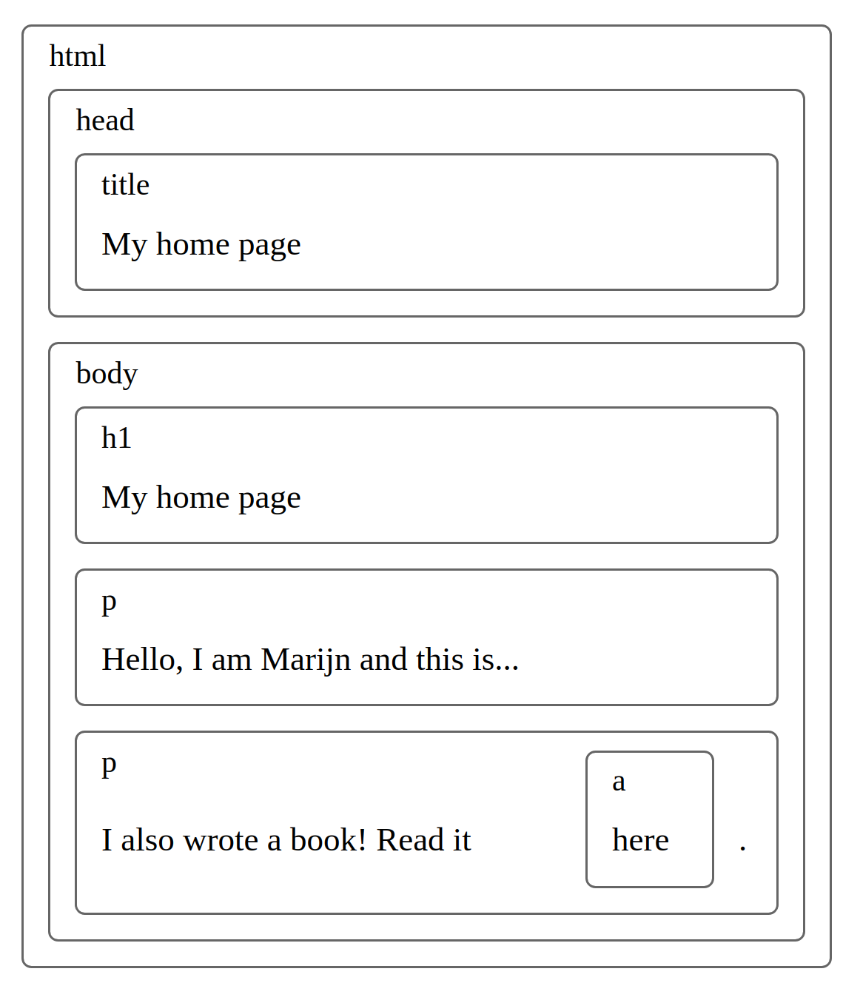
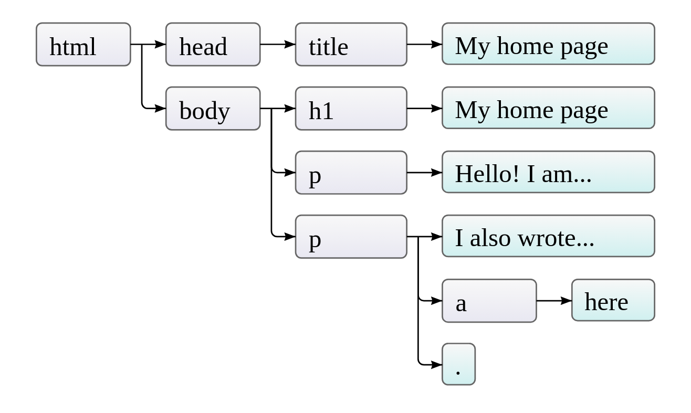

# The DOM

---

When you load a web page in the browser...

1. Retrieves the HTML text and parses it.
2. Builds a _model_ of the document structure
3. Uses this model to render the page on the screen.

<Spacer size={24} />

This is the **D**ocument **O**bject **M**odel.

---

The DOM is a data structure that we can read and modify.

It acts as a _live_ data structure. When it's modified, the page on the screen is updated. 🤯

---

## So what does DOM look like?

You can see it in your developer tools in the browser.

It looks _almost_ identical to the HTML you wrote...

---

The DOM is actually your _corrected_ HTML.

⚠️ This means that it is actually impossible to debug your HMTL with devTools.

---

A nested set of boxes



---

- For each box, there is an objet that we can interact with
- Each node may contain/refer to other nodes that we call _children_.
- Similar to a tree.

---

End nodes are usually called leaves.



---

JavaScript can modify _all_ of the HTML elements on the page.


---

## Getting an element

---

You can access a single DOM node using [`document.querySelector()`](https://www.w3schools.com/jsref/met_document_queryselector.asp)

This takes a CSS selector.

---

### Example

```html
<div class="container">
  <h1 id="title">The title</h1>
</div>
```

```js
const container = document.querySelector(".container");
const title = document.querySelector("#title");
```

---

You can also get _all_ of the elements matching a selector with [`document.querySelectorAll()`](https://www.w3schools.com/jsref/met_document_queryselectorall.asp)

---

## Modify Elements

---

### Modify a Node

You can modify the content of a node with:

- [`.innerText`](https://www.w3schools.com/jsref/prop_node_innertext.asp)
- [`.innerHTML`](https://www.w3schools.com/jsref/prop_html_innerhtml.asp)

---

#### Example

```html
<h1 id="title">The title</h1>
```

```js
// Example
```

---

### Creating and Appending nodes

---

To add a new node to an HTML page, you need to do it in 3 steps.

1. Create the new node
2. Add content to that node
3. add that node to an existing node.

---

- [`document.createElement()`](https://www.w3schools.com/jsref/met_document_createelement.asp)
- [`node.appendChild()`](https://www.w3schools.com/jsref/met_node_appendchild.asp)

```js
// Example
```

---

### Styling DOM elements

We can style elements from JavaScript.

- Use the element's `style` attribute.
- Modify the `classList` of the element.

---

#### The `style` attribute

1. Target the element using one of the methods we've just learned.
2. Modify its `style` attribute.

```html
<div id="my-div">...content...</div>
```

```js
const myDiv = document.querySelector("#my-div");

myDiv.style.background = "purple";
```

---

Inline styles are not ideal:

- Very high specificity
- No access to media queries, pseudo-elements...

---

#### Using `classList`

Calling `myDiv.classList` returns a [`DOMTokenList`](https://developer.mozilla.org/en-US/docs/Web/API/DOMTokenList).

😭 It is _read-only_, but ...

---

... it is _modifiable_. 😃

...

To modify a `classList`, we have a few methods we can call.

- `.add()`
- `.remove()`
- `.toggle()`

```js
// Example
myDiv.classList.add("primary");

myDiv.classList.remove("secondary");

myDiv.classList.toggle("active");
```
